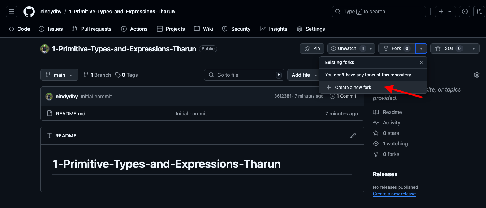

# Repo Overview

- The Exercises folder contains screenshots of problems and the links of where I found them
- Each problem is its own text file. Please write your answers in the **answers.txt** file

# Homework Instructions
1. Please fork this repo

2. Click on "Create fork"
3. Once you forked the repo, you now have write access to edit files and folders
4. Please go through each exercise files in the Exercise folder and write your answers in the answers.txt file
5. If you are stuck, please test out the code in visual studio code 

# Extra Resources
1. The Java API specification is a great resource for understanding all the libraries and classes in Java. Link: https://docs.oracle.com/javase/8/docs/api/ 
2. How-to guide for installing java with visual studio code. Link: https://code.visualstudio.com/docs/languages/java 

